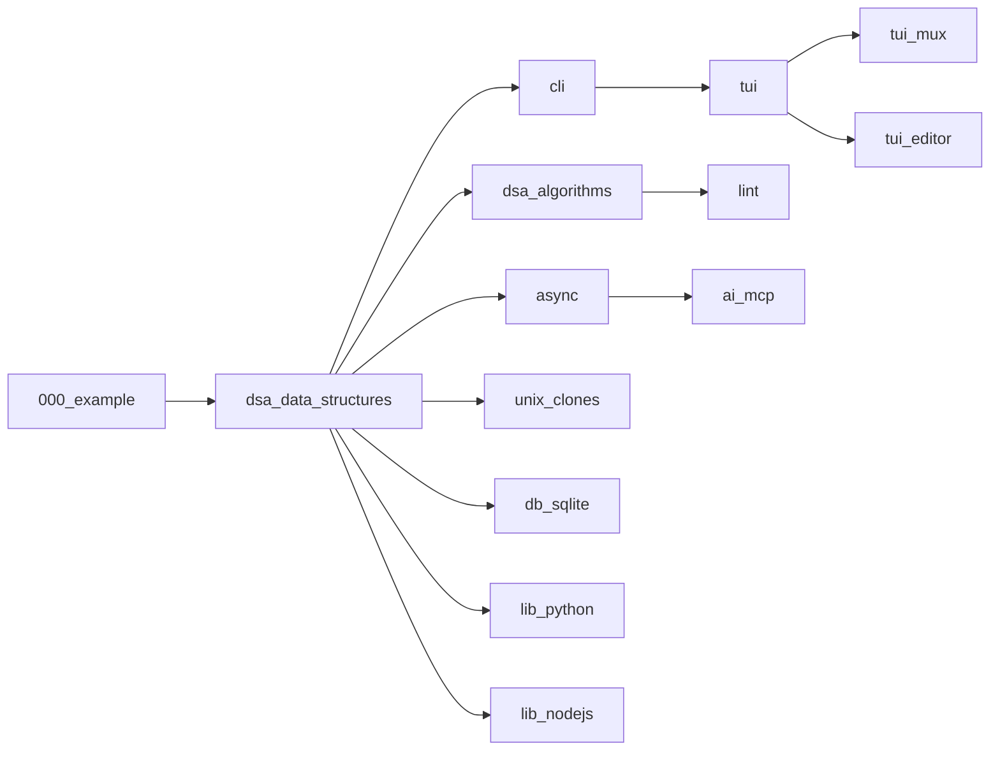

# Learning Rust - Step-by-Step Courses

A comprehensive collection of progressive Rust courses designed to teach Rust concepts through hands-on, incremental lessons. Each course builds on fundamental concepts with real-world examples, comprehensive documentation, and extensive testing.

## 📚 Course Structure

This repository contains 14 specialized courses, each focusing on different aspects of Rust programming:

### Foundation Courses
- **`000_example/`** - Template and reference implementation showing all patterns
- **`dsa_data_structures/`** - Core Rust data structures (Vec, HashMap, BTree, etc.)
- **`dsa_algorithms/`** - Algorithm implementations from O(n²) to O(log n)

### Concurrency & Async
- **`async/`** - Asynchronous programming with futures and async/await

### Command Line & Terminal UI
- **`cli/`** - Building command-line tools with argument parsing
- **`tui/`** - Terminal user interfaces with widgets
- **`tui_mux/`** - Build a tmux clone step-by-step
- **`tui_editor/`** - Create a basic text editor from scratch

### Interoperability
- **`lib_python/`** - Python FFI with PyO3
- **`lib_nodejs/`** - Node.js native modules

### Systems Programming
- **`unix_clones/`** - Recreate classic Unix utilities
- **`lint/`** - Build a basic Rust linter
- **`db_sqlite/`** - Database programming with SQLite
- **`ai_mcp/`** - Model Context Protocol implementation

## 🎯 Learning Philosophy

Each course follows a consistent pattern:
1. **Progressive Difficulty** - Start simple, build complexity gradually
2. **Self-Contained Lessons** - Each file is independently runnable
3. **Real-World Context** - Every concept tied to practical applications
4. **Multiple Implementations** - Show naive, idiomatic, and optimized versions
5. **Comprehensive Testing** - Doctests, unit tests, integration tests, and benchmarks

## 🚀 Getting Started

### Prerequisites
- Rust 1.75+ (install via [rustup](https://rustup.rs/))
- Basic familiarity with terminal/command line

### Quick Start

1. Clone the repository:
```bash
git clone https://github.com/yourusername/learning-rust.git
cd learning-rust
```

2. Build all courses:
```bash
cargo build --workspace
```

3. Run tests to verify everything works:
```bash
cargo test --workspace --all-targets
cargo test --workspace --doc
```

4. Start with the example course:
```bash
cd courses/000_example
cargo test
cargo run --example full_demo
```

## 📖 How to Use This Repository

### For Self-Study

1. **Start with `000_example`** to understand the pattern
2. **Choose a course** based on your interests
3. **Read lessons sequentially** (001, 002, 003...)
4. **Run the code** and experiment with modifications
5. **Complete the exercises** in each lesson
6. **Run tests** to verify understanding

### Lesson Structure

Each lesson file contains:
- **Context** - Real-world scenario explaining why this matters
- **Concepts** - What you'll learn
- **Code** - Progressive implementations
- **Doctests** - Inline executable examples
- **Exercises** - Practice problems

Example lesson structure:
```rust
//! # Lesson 002: Linear Search
//!
//! ## Context
//! In a product catalog, we need to find items...
//!
//! ## Concepts Covered
//! - Generic types
//! - Iterator patterns
//! - Performance analysis
```

## 🧪 Testing

Every lesson includes multiple levels of testing:

```bash
# Run all tests
cargo test --workspace

# Run doctests only
cargo test --workspace --doc

# Run specific course tests
cargo test -p courses_000_example

# Run with output
cargo test -- --nocapture

# Run benchmarks
cargo bench --workspace
```

## 📊 Benchmarking

Performance-critical algorithms include benchmarks:

```bash
cd courses/dsa_algorithms
cargo bench
```

## 🔧 Development

### Adding New Lessons

1. Follow the naming convention: `XXX_topic.rs`
2. Use the documentation template from `000_example`
3. Include at least 3 doctests
4. Add corresponding test file in `tests/`
5. Update the course README

### Code Quality

Before committing:
```bash
# Format code
cargo fmt --all

# Check lints
cargo clippy --workspace --all-targets -- -D warnings

# Verify tests
cargo test --workspace
```

## 📝 Course Progression Map



## 🎓 Learning Paths

### Path 1: Data Structures & Algorithms
1. `dsa_data_structures` → `dsa_algorithms`

### Path 2: Systems Programming
1. `unix_clones` → `cli` → `db_sqlite`

### Path 3: Terminal Applications
1. `cli` → `tui` → `tui_mux` or `tui_editor`

### Path 4: Language Interop
1. `lib_python` or `lib_nodejs`

### Path 5: Async Programming
1. `async` → `ai_mcp`

## 📚 Resources

### Documentation
- [The Rust Book](https://doc.rust-lang.org/book/)
- [Rust by Example](https://doc.rust-lang.org/rust-by-example/)
- [Rust API Documentation](https://doc.rust-lang.org/std/)

### Tools Used
- [cargo](https://doc.rust-lang.org/cargo/) - Build system
- [clippy](https://github.com/rust-lang/rust-clippy) - Linter
- [rustfmt](https://github.com/rust-lang/rustfmt) - Formatter
- [criterion](https://github.com/bheisler/criterion.rs) - Benchmarking

## 🤝 Contributing

Contributions are welcome! Please:
1. Follow the established patterns
2. Include comprehensive documentation
3. Add tests for new functionality
4. Ensure all tests pass
5. Run clippy and rustfmt

## 📄 License

This project is designed for educational purposes. See LICENSE file for details.

## 🙏 Acknowledgments

Inspired by:
- The Rust community's emphasis on documentation
- Step-by-step learning approaches in programming education
- Real-world application-driven teaching

---

**Happy Learning! 🦀**

Start with `courses/000_example/` to see the pattern, then dive into any course that interests you!